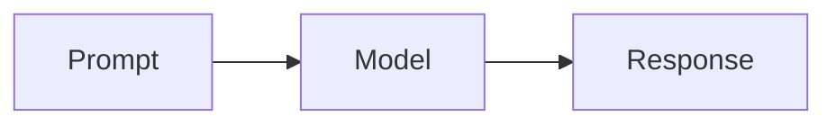

# Reader-supported Codelab blocks

Use these constructs only when they make the learner's next decision, action, or check easier. They are not decoration: plain prose is usually clearer when there is no relationship, practice, or verification to expose.

## `mermaid`

~~~markdown

~~~

The importer preserves the fence as a code block and the reader renders supported flowcharts with Mermaid. Use it for a compact process, dependency, or comparison that would be harder to scan in a paragraph. Keep the diagram small, label the decision points, and make the surrounding prose explain the learning point. If Mermaid cannot render the source, the learner sees the source instead.

## `hint-python`, `hint-bash`, and `hint-powershell`

~~~markdown
```hint-python
def normalise(prompt: str) -> str:
    return prompt.strip()
```
~~~

The importer separates each `hint-*` fence into an editor part and preserves its code. Use a hint for a small, inspectable reference solution after the learner has had a real chance to try the task; do not put the primary instruction or a long explanation inside it. `python`, `bash`, and `powershell` communicate the intended syntax and file extension. A hint is optional: omit it when there is no source-grounded sample that makes the learner's next action or check easier.

## `:::reflect`

~~~markdown
:::reflect
What signal would tell you that this prompt is too broad?
:::
~~~

The importer turns this container into a discussion part. Use it for one answerable reflection that asks the learner to justify a choice, name evidence, or compare a result. Put the context and constraints in the preceding prose; do not use it as a decorative pause or a multi-question survey.

## `:::goal`, `:::decision`, `:::caution`, and `:::checkpoint`

~~~markdown
:::goal{title="NB3 cần chứng minh gì?"}
Nêu câu hỏi hoặc đầu ra của bước này.
:::

:::decision{title="Lợi ích và trade-off"}
Nêu lựa chọn mà người học phải hiểu trước khi làm.
:::

:::caution{title="Điều không được suy ra"}
Nêu một rủi ro hoặc giới hạn có thật từ nguồn.
:::

:::checkpoint{title="Có thể sang bước tiếp theo khi"}
Nêu artifact hoặc trạng thái có thể kiểm tra.
:::
~~~

The importer renders these containers as reader callout cards. Use `goal` for
the current question/outcome, `decision` for a source-grounded choice or
trade-off, `caution` for a concrete risk, and `checkpoint` for a verification
signal. One or two cards in a substantial section are normally enough. They
are always visible cards, not collapsible disclosure controls; do not fake a
dropdown with raw HTML.

## Glossary link

~~~markdown
[LLM](#glossary "Mô hình ngôn ngữ lớn")
~~~

The importer recognizes this exact glossary form and preserves its term and definition as reader-safe semantic markup; the reader shows an inline definition trigger with an accessible popover. Use it for a short unfamiliar term whose definition is needed at that point in the lesson. Keep the definition concise; use an ordinary link when the learner needs to leave the lesson for a source or resource.

## Pipe table

~~~markdown
| Cách làm | Khi dùng |
| --- | --- |
| Few-shot | Khi cần minh hoạ khuôn mẫu |
| Ràng buộc rõ | Khi đầu ra phải tuân thủ format |
~~~

The importer preserves pipe tables as Markdown and the reader renders a table. Use one for a true side-by-side comparison, a decision matrix, or a small troubleshooting lookup. Keep columns few and cells short; if the reader must follow a sequence, write steps instead.

## Checklist

~~~markdown
- [ ] Đã nêu đầu ra mong muốn
- [ ] Đã thêm ràng buộc kiểm tra được
~~~

The importer renders a checklist as the reader's objectives list. Use it to make a finite readiness or verification set easy to scan. It is presentation, not learner-persisted completion state, so do not use it to promise tracking or grading.

## Ordinary code fence

~~~markdown
```bash
uv run pytest tests/test_prompt.py
```
~~~

The importer preserves an ordinary fence as a syntax-highlighted reader code block. Use it for commands, configuration, expected output, or a small example the learner needs to inspect or copy accurately. Do not add a code fence merely to make a section look technical. State what success looks like in the prose around it; use a `hint-*` fence instead when the code is a solution to attempt before revealing.
